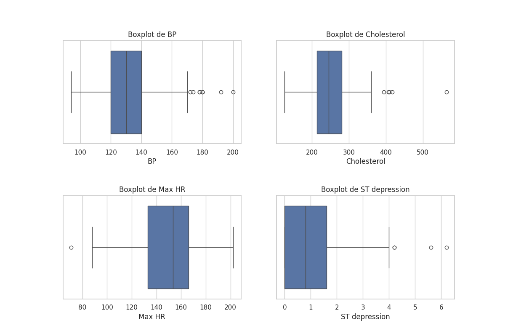
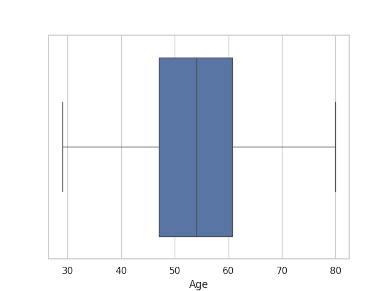
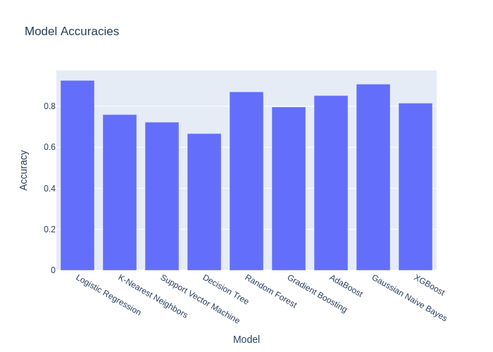
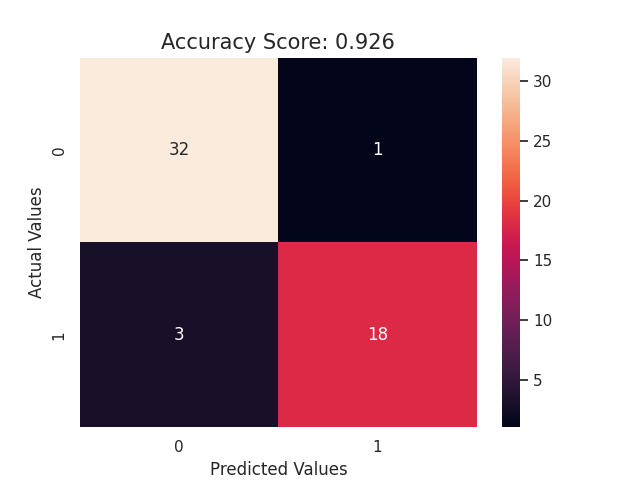

#  Análise Preditiva de Doenças Cardíacas: Um Estudo com Machine Learning
Doenças cardíacas são a principal causa de morte no mundo. A detecção precoce é fundamental para salvar vidas. Neste estudo, utilizamos o poder do aprendizado de máquina para desenvolver um modelo capaz de prever o risco de doenças cardíacas em indivíduos, analisando informações médicas relevantes. Nosso objetivo é fornecer aos profissionais da saúde uma ferramenta inovadora para identificar pacientes em risco e promover intervenções preventivas.

## 1. Coleta de Dados

O dataset utilizado neste projeto foi retirado do kaggle https://www.kaggle.com/datasets/kapoorprakhar/cardio-health-risk-assessment-dataset , `doencacoracao.csv`, contém informações médicas relevantes para a predição de doenças cardíacas.  As variáveis presentes no conjunto de dados incluem:

* **Variáveis Demográficas:**
    * Idade (Age)
    * Sexo (Sex)
* **Histórico Médico:**
    * Tipo de dor no peito (Chest pain type)
    * Pressão arterial (BP)
    * Nível de colesterol (Cholesterol)
    * Diabetes (FBS over 120)
* **Resultados de Exames:**
    * Resultados de eletrocardiograma (EKG results)
    * Frequência cardíaca máxima (Max HR)
    * Angina induzida por exercício (Exercise angina)
    * Depressão do segmento ST (ST depression)
    * Inclinação do segmento ST (Slope of ST)
    * Número de vasos sanguíneos com obstrução (Number of vessels fluro)
    * Resultados do teste de tálio (Thallium)
* **Variável Alvo:**
    * Presença ou ausência de doença cardíaca (Heart Disease)
## 2. Analise Exploratoria
   Fiz utilização do grafico boxplot para encontrar outliers e padrões
   

   **Insigths deste boxplot**
   * O batimento cardiaco esta concentrado entre 120BPM a 140BPM. Também notamos que existe outliers acima de 170BPM
   * Colesterol concentrado entre 200 a 300, havendo outliers acima de 400.
   * A frequencia maxima cardiaco esta entre 130 a 170.
   * A drepressão do segmento ST esta concentrada entre 0 e 2, havendo outliers acima de 4.

   Fiquei curioso a respeito da idade e tambem fui explorar.
   
   
   **Insigth deste boxplot**
   * Pessoas que sofrem com problemas do coração tem entre 48 a 62 anos de idade.
## 3. Modelagem

### Pré-processamento dos Dados

* **Codificação de Rótulos (Label Encoding):** Variáveis categóricas foram convertidas em valores numéricos.
* **Padronização (StandardScaler):** Variáveis numéricas foram padronizadas (média zero, desvio padrão um).

### Divisão dos Dados

* **Treinamento (80%):** Dados usados para treinar os modelos.
* **Teste (20%):** Dados usados para avaliar os modelos.

### Treinamento e Avaliação dos Modelos

Diversos modelos de classificação foram treinados e avaliados, utilizando a acurácia como métrica:

* Regressão Logística
* K-Nearest Neighbors (KNN)
* Support Vector Machines (SVM)
* Árvores de Decisão
* Random Forest
* Gradient Boosting
* AdaBoost
* Naive Bayes
* XGBoost

### Seleção do Melhor Modelo
Foi gerado um grafico demostrando qual dos modelos teve a maior acurácia.

O modelo de **Regressão Logística** obteve a maior acurácia (92.5%) e foi selecionado.

### Avaliação Detalhada do Modelo Escolhido

A matriz de confusão foi utilizada para analisar o desempenho do modelo de Regressão Logística, revelando os verdadeiros positivos, verdadeiros negativos, falsos positivos e falsos negativos.

A matrix de confusão nos mostrou que houve 3 falsos negativos e 1 falso positivo.

## 3. Conclusões

* A análise exploratória forneceu insights valiosos sobre as variáveis e suas relações com a doença cardíaca.
* O modelo de Regressão Logística demonstrou ser eficaz na previsão da doença cardíaca, com alta acurácia.
* A matriz de confusão confirmou o bom desempenho do modelo tanto na identificação de pacientes com doença cardíaca quanto na identificação de pacientes sem a doença.
